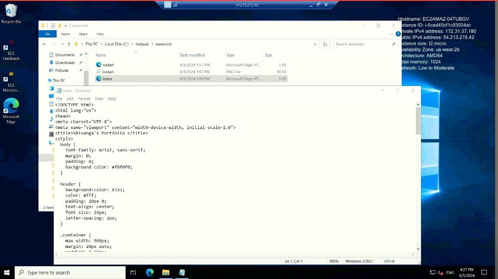
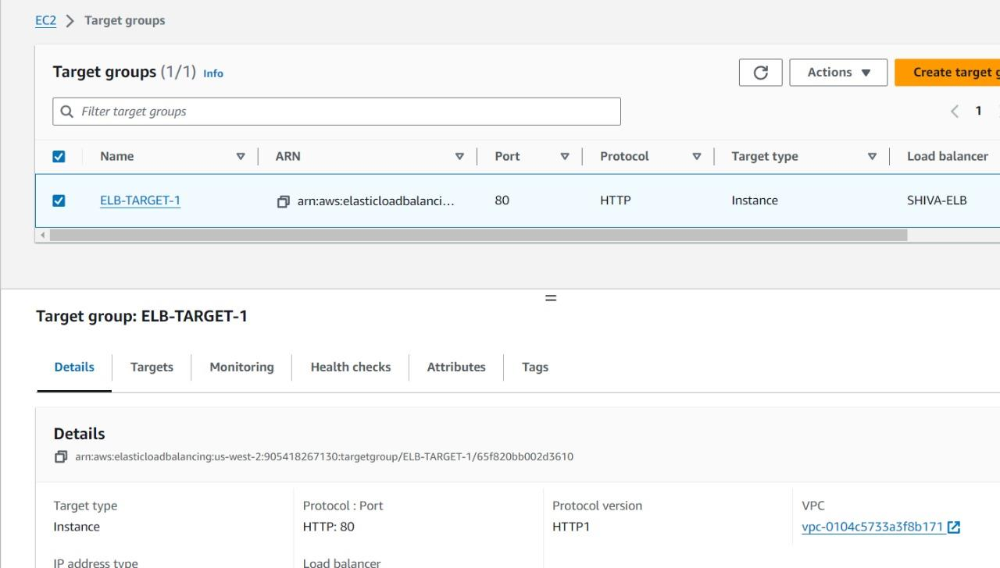

# AWS Load Balancer Setup with High Availability (Linux & Windows)

## Project Overview
This project demonstrates the configuration of an AWS Application Load Balancer (ALB) to achieve high availability by distributing traffic between Linux and Windows EC2 instances. The setup was tested across desktop and mobile devices to verify proper load balancing.

---

## Screenshots & Explanation

### Screenshot 1 – Linux Server Setup

Linux EC2 instance launched successfully and an HTML file was created and served using Apache web server.

### Screenshot 2 – Windows Server Setup

Windows Server EC2 instance configured with IIS, and an HTML file was successfully hosted after installing IIS.

### Screenshot 3 – EC2 Instance Connectivity

Both Linux and Windows EC2 instances are running and connected successfully.

### Screenshot 4 – Security Group Configuration

Security groups configured to allow HTTP/HTTPS traffic along with SSH and RDP access.

### Screenshot 5 – Load Balancer Creation

Application Load Balancer (ALB) created successfully.

### Screenshot 6 – Listener & Port Configuration

ELB listener configured on port 80 (HTTP) to forward traffic to target instances.

### Screenshot 7 – Target Group Configuration

Target group created and EC2 instances registered for load balancing.

### Screenshot 8 – Windows Server Output

Web application output served from the Windows Server instance.

### Screenshot 9 – Linux Server Output

Web application output served from the Linux Server instance.

### Screenshot 10 – CloudWatch Monitoring

CloudWatch metrics used to monitor load balancer and EC2 instance performance.

### Screenshot 11 – Mobile Testing (Windows Server)

Website accessed from a mobile device, traffic served by Windows Server through load balancer.

### Screenshot 12 – Mobile Testing (Linux Server)

Website accessed from a mobile device, traffic served by Linux Server through load balancer.

---

## Configuration & Setup Summary
- Launched Linux and Windows EC2 instances
- Installed Apache on Linux and IIS on Windows
- Configured security groups for required access
- Created Application Load Balancer (ALB)
- Configured listener and target groups
- Enabled CloudWatch monitoring
- Tested load balancing across desktop and mobile devices

---

## Conclusion
The AWS Application Load Balancer was successfully configured to distribute traffic between Linux and Windows EC2 instances. Testing confirmed that requests were balanced correctly across both servers on multiple devices. This project demonstrates a real-world high availability architecture using AWS.
