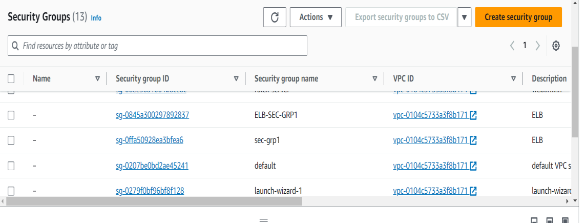
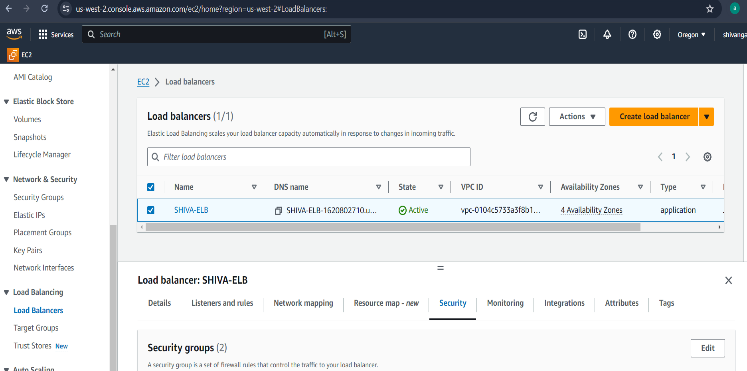
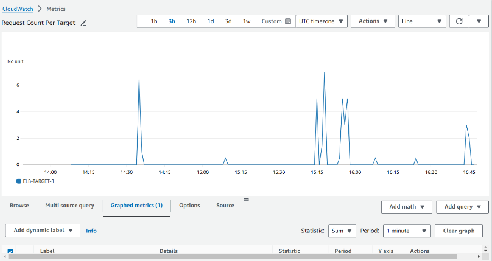

# AWS Load Balancer Setup with High Availability

## Project Overview
This project demonstrates how to configure a highly available web application using AWS Application Load Balancer (ALB) with both Linux and Windows EC2 instances. The load balancer distributes traffic and ensures reliability and scalability.

---

## Architecture & Screenshots

### Screenshot 1

Linux EC2 instance created and connected successfully using SSH.

### Screenshot 2

Apache web server installed and running on Linux instance.

### Screenshot 3

Windows Server EC2 instance created and accessed using RDP.

### Screenshot 4

IIS installed and configured on Windows Server.

### Screenshot 5

Application Load Balancer creation process.

### Screenshot 6

Listener configuration for HTTP/HTTPS.

### Screenshot 7

Target group created for EC2 instances.

### Screenshot 8

Linux and Windows servers registered in target group.

### Screenshot 9

Health check status showing healthy instances.

### Screenshot 10

CloudWatch metrics monitoring load balancer.

### Screenshot 11

Accessing application through Load Balancer DNS.

### Screenshot 12

Testing load balancing from different devices.

---

## Configuration & Setup Summary
- Created Linux and Windows EC2 instances.
- Installed Apache on Linux and IIS on Windows.
- Configured security groups for required ports.
- Created Application Load Balancer.
- Registered instances in target group.
- Enabled health checks and CloudWatch monitoring.

---

## Conclusion
This project successfully demonstrates a real-world cloud architecture using AWS. The Application Load Balancer ensures high availability and fault tolerance by distributing traffic across multiple servers. This setup improves reliability, performance, and scalability of web applications.
